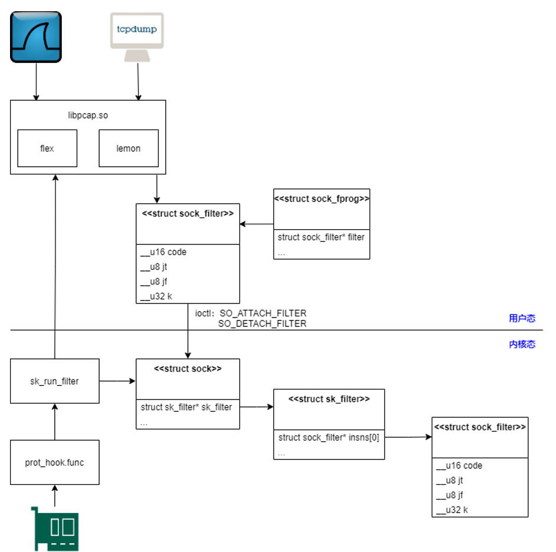

# bpf详解

## 介绍

BPF的全称是Berkeley Packet Filter,即伯克利报文过滤器,它的设计思想来源于 1992 年的一篇论文.最初,BPF是在BSD内核实现的,后来,由于其出色的设计思想,其他操作系统也将其引入,包括Linux,有意思的是,Linux最初将它的实现命名为LSF(Linux Socket Filter),看上去是想将它与 Berkeley 划清界限,不过后来可能也许觉得没什么意义,便还是沿用 BPF 这个名字了,内核文档也大方地写上了Linux Socket Filtering aka Berkeley Packet Filter (BPF).

那么BPF有什么功能呢?从 Berkeley Packet Filter 这个名字看,它是报文(Packet)过滤器(Filter),而实际上,它的功能也确实如其名字一样单纯:用户可以使用它将感兴趣的报文过滤出来,也就是抓包.这有没有让你想到tcpdump和wireshark事实上,tcpdump以及wireshark的运行时过滤器正是使用了BPF,具体方式稍后本文会有描述。

## bpf整体架构

为了对 BPF 有一个整体上的认识,所以让首先来看看 BPF 的结构图(图片来源于论文)吧


从图中可以看出,BPF是作为内核报文传输路径的一个旁路存在的.当报文到达内核驱动后,内核将报文上送到协议栈的同时,会额外将报文的一个副本交给BPF.之后,报文会经过BPF内部逻辑的过滤(用户自定义),然后最终送到用户程序(比如tcpdump或wireshark)

## bpf用户态程序实战


BPF允许用户程序添加一个filter到任何的socket，来允许或拒绝某些类型的数据包通过socket.LSF和BSD的BPF的过滤代码结构相同、


Linux上的BPF.只要创建filter code,然后通过SO_ATTACH_FILTER选项发送给内核,如果内核通过检查,内核将立即开始执行socket的filtering.


也可以通过SO_DETACH_FILTER选项来detach filters.这可能不常用,当你关闭socket时，它上面的filter自动移除.另一个不常用的的场景是添加另外一个filter到同一个socket.内核将移除旧的使用新的,如果新的检查的失败,则仍然使用旧的filter.


SO_LOCK_FILTER选项可以锁定一个filter,一旦设置,filter不能移除或改变.


这里只谈论套接字,但是BPF在linux的使用场景还有很多,如xt_buf,cls_bpf等.

### **与bpf相关的api**

```c
socket(AF_PACKET, SOCK_RAW, ...)
bind(sockfd, iface)
setsockopt(sockfd, SOL_SOCKET, SO_ATTACH_FILTER, ...)
recv(sockfd, ...)
```

通过setsockopt系统调用,用户自定义的过滤程序将进入内核空间,并作为钩子对每个通过网络协议栈的网络包进行过滤,抓取并拷贝命中的网络包提交到监听 socket 的接收等待队列中.下列的示例程序展示了配置代理过滤程序及提取过滤结果的逻辑.

相关结构体:

```c
struct sock_filter {  /* Filter block */
    __u16   code;   /* Actual filter code */
    __u8    jt; /* Jump true */
    __u8    jf; /* Jump false */
    __u32   k;      /* Generic multiuse field */
};
```

这个结构体包含`code jt jf k`四个字段. `jt` 和 jf 是 jump offset,k 是一个 code 可以使用的通用字段

```c
struct sock_fprog {           /* Required for SO_ATTACH_FILTER. */
    unsigned short        len;  /* Number of filter blocks */
    struct sock_filter __user *filter;
};
```

sock_fprog中的**filter**是一个数组,len为数组的个数,filter指向该数组

过滤器一般是首先使用布尔操作符编写的可读性较强的代码,随后该代码被编译成伪代码传递给BPF驱动

下面是经过编译的bsd代码,这段BPF代码只过滤了22号端口


```c
#include <sys/socket.h>
#include <sys/types.h>
#include <arpa/inet.h>
#include <linux/if_ether.h>
/* ... */
 
/* From the example above: tcpdump -i em1 port 22 -dd */
struct sock_filter code[] = {
    { 0x28,  0,  0, 0x0000000c },
    { 0x15,  0,  8, 0x000086dd },
    { 0x30,  0,  0, 0x00000014 },
    { 0x15,  2,  0, 0x00000084 },
    { 0x15,  1,  0, 0x00000006 },
    { 0x15,  0, 17, 0x00000011 },
    { 0x28,  0,  0, 0x00000036 },
    { 0x15, 14,  0, 0x00000016 },
    { 0x28,  0,  0, 0x00000038 },
    { 0x15, 12, 13, 0x00000016 },
    { 0x15,  0, 12, 0x00000800 },
    { 0x30,  0,  0, 0x00000017 },
    { 0x15,  2,  0, 0x00000084 },
    { 0x15,  1,  0, 0x00000006 },
    { 0x15,  0,  8, 0x00000011 },
    { 0x28,  0,  0, 0x00000014 },
    { 0x45,  6,  0, 0x00001fff },
    { 0xb1,  0,  0, 0x0000000e },
    { 0x48,  0,  0, 0x0000000e },
    { 0x15,  2,  0, 0x00000016 },
    { 0x48,  0,  0, 0x00000010 },
    { 0x15,  0,  1, 0x00000016 },
    { 0x06,  0,  0, 0x0000ffff },
    { 0x06,  0,  0, 0x00000000 },
};
 
struct sock_fprog bpf = {
    .len = ARRAY_SIZE(code),
    .filter = code,
};


sock = socket(PF_PACKET, SOCK_RAW, htons(ETH_P_ALL));
if (sock < 0)
    /* ... bail out ... */

ret = setsockopt(sock, SOL_SOCKET, SO_ATTACH_FILTER, &bpf, sizeof(bpf));
if (ret < 0)
    /* ... bail out ... */

/* ... */
close(sock);
```

上述代码将一个filter attach到了一个`PF_PACKET`类型的socket,功能是放行所有IPv4/IPv6 22端口的包,其他包一律丢弃

这里只展示了attach代码;detach时,`setsockopt`除了`SO_DETACH_FILTER`不需要其他参数; `SO_LOCK_FILTER`可用于防止`filter`被`detach`,需要带一个整形参数 0 或 1.

注意 socket filters 并不是只能用于 PF_PACKET 类型的 socket,也可以用于其他 socket 家族.

下图是CBPF支持的指令:


### setsockopt()不同场景下调用

```c
setsockopt(sockfd, SOL_SOCKET, SO_ATTACH_FILTER, &val, sizeof(val));
setsockopt(sockfd, SOL_SOCKET, SO_DETACH_FILTER, &val, sizeof(val));
setsockopt(sockfd, SOL_SOCKET, SO_LOCK_FILTER, &val, sizeof(val));
```

## bpf原理详解

### 基本概率

tcpdump如何过滤指定的报文呢?举个例子,当使用`tcpdump tcp dst port 8080`时,BPF的过滤逻辑如何将目的端口为8080的 TCP 报文过滤出来? 可能最容易想到的方式就是粗暴的硬编码了, 比如像下面这样编写内核模块.

```c
switch (protocol)
{
    case (TCP):
       if (dstport != 8080)
           drop
       ......
    case (UDP):
       ......
    case (ICMP):
       ......
}
```

每次抓包都需要加载内核模块?

BPF 采用的是一种 **Pseudo-Machine** 的方式

这个词可以翻译为虚拟机,它是 BPF 过滤功能的核心逻辑.这个虚拟机并不负责,它只有一个累加器( accumulator ),一个索引寄存器 ( index register ),一小段内存空间 ( memory store ),和一个隐式的 PC 指针( implicit program counter ).

它支持的指令集也非常有限,可分为以下几类 (翻译自论文)


    LOAD 指令:将一个数值加载入 accumulator 或者 index register，这个值可以为一个立即数( immediate value )、报文的指定偏移、报文长度或者内存空间存放的值
    STORE 指令:将 accumulator 或者 index register 中存储的值存入内存空间
    ALU 指令:对 accumulator 存储的数进行逻辑或者算术运算
    BRANCH 指令:简单的 if 条件控制指令的执行流
    RETURN 指令:退出虚拟机，若返回 FALSE (0)，则表示丢弃该报文
    其他指令:accumulator 和 index register 的值的相互传递


其支持的指令的长度也是固定的:


其中 opcode 表示指令类型,而 jt ( jump true ) 和 jf ( jump false ) 用于条件控制,它们用于 BRACH 指令中,指示如果条件为真/假时,下一条应该执行的指令.而 k 表示地址/值,这个字段在不同的 opcode 中有不同的意义.

上面这一段也许太抽象了,还是以 tcpdump tcp dst port 8080 这个例子来解释好了.

tcpdump 提供了一个内置的选项 -d,可以将匹配规则对应的 BPF 指令以易读的方式展示出来.

```shell
tcpdump -d tcp dst port 8080
root@ubuntu-1:/home/user1# tcpdump -d tcp dst port 8080
(000) ldh      [12]                            // 以太网首部共 14 byte: DMAC(6 bytes) + SMAC(6 bytes) + Type(2 bytes), 因此这里表示将 Type 的值加载进 accumulator
(001) jeq      #0x86dd          jt 2    jf 6   // 将 accumulator 的值与 0x86dd (IPv6) 比较. 若为真, 则继续执行 002, 否则 jump 到指令 006
(002) ldb      [20]                            // 将 IPv6 首部中表示传输层协议的 Next Header 加载到 accumulator
(003) jeq      #0x6             jt 4    jf 15  // 将 accumulator 的值与 6 (TCP) 比较. 若为真，则继续执行 004，否则 jump 到 015
(004) ldh      [56]                            // 将 TCP 首部中的 Destination Port 的值加载到 accumulator
(005) jeq      #0x1f90          jt 14   jf 15  // 将 accumulator 的值与 0x1f90 (8080) 比较. 若为真，则 jump 到 014, 否则 jump 到 015
(006) jeq      #0x800           jt 7    jf 15  // 将 accumulator 与 0x0800 (IPv4) 比较. 若为真，则继续执行 007, 否则 jump 到 015
(007) ldb      [23]                            // 将 IPv4 首部中表示传输层协议的 Protocol 加载到 accumulator
(008) jeq      #0x6             jt 9    jf 15  // 将 accumulator 的值与 6 (TCP) 比较. 若为真，则继续执行 009，否则 jump 到 015
(009) ldh      [20]                            // 将 IPv4 首部中表示传输层协议的 Flags + Fragment Offset 加载到 accumulator
(010) jset     #0x1fff          jt 15   jf 11  // 将 accumulator 的值与 0x1fff 按位与(得到 Fragment Offset)，如果为真(非首片的分片报文) 则 jump 到 015, 否则继续执行 011
(011) ldxb     4*([14]&0xf)                    // 将 IPv4 首部中的 IHL * 4 的值加载到 index register，即得到 IPv4 首部的长度 (为了得到找到 TCP 首部的位置)
(012) ldh      [x + 16]                        // 将 TCP 首部中的 Destination Port 的值加载到 accumulator. eg. 不包含 IP 选项时，x = 20, 那么这里就等效于 [36]
(013) jeq      #0x1f90          jt 14   jf 15  // 将 accumulator 的值与 0x1f90 (8080) 比较. 若为真，则 jump 到 014, 否则 jump 到 015
(014) ret      #262144                         // 返回非0 表示该报文通过过滤
(015) ret      #0                              // 返回0 表示该报文需要丢弃
```

在使用 tcpdump(linux中的wireshark原理相同) 时, libpcap 会将我们的过滤语句翻译为 bpf 虚拟机能识别的机器码,然后将其下载到内核

### 内核源码分析

下面是内核2.4.0版本的过滤到内核的示意图:



其中在2.4.0版本的内核中最核心的函数是`sk_run_filter`(在4.4.1版本的内核中是函数`run_filter`,由于新版本内核反而更好阅读所以以4.4.1版本作为例子)

tcpdump(wireshark)通过创建关心所有类型 (ETH_P_ALL) 的 Packet Socket能在内核收包时获取到skb(deliver skb,分发流量到tcpdump)

而核心收包函数为packet_rcv,packet socket在创建时注册的函数为packet_rcv,这里便会进行过滤操作

```c
static int packet_rcv(struct sk_buff *skb, struct net_device *dev,
		      struct packet_type *pt, struct net_device *orig_dev)
{
    ......
	sk = (struct sock *) pt->data;
	po = sk->protinfo.af_packet;
	......
    res = sk_run_filter(skb, sk->filter->insns, sk->filter->len);
    ......
}     

// 下面的代码是4.4.1的摘录
static int packet_rcv(struct sk_buff *skb, struct net_device *dev,
		      struct packet_type *pt, struct net_device *orig_dev)
{
    ......
    sk = pt->af_packet_priv;
    po = pkt_sk(sk);
	......
    res = run_filter(skb, sk, snaplen);
    ......
}   
```

而 run_filter同理 的功能就是取下 sk 上设置的 sk_filter 结构,然后 SK_RUN_FILTER 这个结构

```c
static unsigned int run_filter(const struct sk_buff *skb,
				      const struct sock *sk,
				      unsigned int res)
{
	struct sk_filter *filter;

	rcu_read_lock();
	filter = rcu_dereference(sk->sk_filter);
	if (filter != NULL)
		res = SK_RUN_FILTER(filter, skb); // For non-JIT: sk_run_filter(SKB, filter->insns) ; For JIT： (*filter->bpf_func)(SKB, filter->insns)
	rcu_read_unlock();
	return res;
}
```

这里 SK_RUN_FILTER 根据是否内核使用 JIT 有两种定义,JIT 是一种通过将 BPF 虚拟机指令码映射成主机指令,从而提升 BPF filter 性能的方式.由于本文的中心是 BPF,因此就只考虑不使用 JIT 的情景.即这里是使用 SK_RUN_FILTER 等于调用 sk_run_filter.

而 sk_run_filter 正是 BPF 虚拟机逻辑的核心(4.4.1做了封装没有这个函数了这里建议看内核2.4.0的代码).贴一段函数的开头吧,从这里可以看到 BPF 设计的 accumulator (A), index register (X),内存空间(mem),而函数逻辑便是虚拟机处理指令的逻辑.

```c
int sk_run_filter(struct sk_buff *skb, struct sock_filter *filter, int flen)
{
	unsigned char *data = skb->data;
	/* len is UNSIGNED. Byte wide insns relies only on implicit
	   type casts to prevent reading arbitrary memory locations.
	 */
	unsigned int len = skb->len;
	struct sock_filter *fentry;	/* We walk down these */
	u32 A = 0;	   		/* Accumulator */
	u32 X = 0;   			/* Index Register */
	u32 mem[BPF_MEMWORDS];		/* Scratch Memory Store */
	int k;
	int pc;
    ......
}
```

从上面可以看出,sk_filter 是 Linux 的 BPF 实现中一个很关键的数据结构,也的确是这样,sk_filter 记录了用户设置的虚拟机指令.

```c
struct bpf_prog {
    ......
	u32			len;		/* BPF 指令的数目, 也就是 insns 的长度 */
    ......
	unsigned int		(*bpf_func)(const struct sk_buff *skb,
					    const struct bpf_insn *filter); /* JIT回调 */
	/* Instructions for interpreter */
	union {
		struct sock_filter	insns[0];   /* 实际BPF 指令 */
		struct bpf_insn		insnsi[0];  /* 实际JIT 回调指令 */
	};
};

struct sk_filter {
	atomic_t	refcnt;
	struct rcu_head	rcu;
	struct bpf_prog	*prog;
};
```

那么问题来了,这个 sk_filter 中记录的指令是如何被设置的呢? 还有 sk_filter 本身是何时被设置到 sk->sk_filter 上的呢？

答案是:通过 Socket的SO_ATTACH_FILTER 选项,用户可以将用户空间准备好的 BPF 虚拟机指令灌入内核.

```c
int sock_setsockopt(struct socket *sock, int level, int optname,
		    char __user *optval, unsigned int optlen)
......
	case SO_ATTACH_FILTER:
		ret = -EINVAL;
		if (optlen == sizeof(struct sock_fprog)) {
			struct sock_fprog fprog;

			ret = -EFAULT;
			if (copy_from_user(&fprog, optval, sizeof(fprog))) // 从用户空间拷贝 BPF 虚拟机指令码
				break;

			ret = sk_attach_filter(&fprog, sk);
		}
		break;
......
```

以上就是bpf在内核的实现,现在很火的ebpf技术也基于此项技术做出的.

