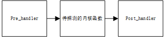

# 内核调试以及监控框架kprobe

## kprobe用来干什么

kprobe是一种内核调试以及监控手段,它可以动态地跟踪内核的行为,收集debug信息和性能信息。

它解决了**内核调试添加打印信息每次都要重新编译的问题**。当然kprobe现在已经不止于此了。

可以几乎跟踪内核所有的代码地址,不允许跟踪的名单blacklist在`/sys/kernel/debug/kprobes/blacklist`

kprobe有三个功能:

- kprobe:
    
    可以插入内核的任何指令

- jprobe:

    可以插入内核的某个函数

- kretprobe:

    可以在函数返回时触发

kprobe可以在系统运行期间,自定义回调函数,动态插入探测点(监控的函数)。当内核执行到探测点时会调用回调函数。同时也可以动态的移除探测函数。

从这里可以得出监控主机(客户机)以及实现hids可以使用kprobe。

## kprobe基本调用

探测点类型:

1. pre_handler: 在被探测函数执行前回调
2. post_handler: 在被探测函数执行时回调
3. fault_handler(很少使用): 执行期间发生错误时执行回调
4. break_handler(很少使用):执行期间发生中断时执行回调

执行流程如下图:



### kprobe核心api如下:

```c
#include <linux/kprobes.h>
int register_kprobe(struct kprobe *p);
void unregister_kprobe(struct kprobe *p);
```

### kprobe核心结构体

其中kprobe结构体如下:

```c
struct kprobe {
    /*用于保存kprobe的全局hash表,以被探测的addr为key*/
	struct hlist_node hlist;

	/* 当对同一个探测点存在多个探测函数时,所有的函数挂在这条链上 */
	struct list_head list;

	/*count the number of times this probe was temporarily disarmed */
	unsigned long nmissed;

	/* 被探测的函数目标地址,注意,只能是addr或是symbol_name其中一个填入了值,
    如果两个都填入,在注册该探测点的时候会出现错误,提示为-21 */
	kprobe_opcode_t *addr;

	/* symblo_name的存在,允许用户指定函数名而非确定的地址,在设置的时候就可以直接设置函数名,
    当然也可以通过内核函数kallsyms_lookup_name("xx")去获取具体的函数地址然后添值 */
	const char *symbol_name;

	/* 如果被探测点为函数内部某个指令,需要使用addr + offset的方式
    从这点也可以看出,kprobe可以hook在内核中的任何位置 */
	unsigned int offset;

	/* 探测函数,在目标探测点执行之前调用 */
	kprobe_pre_handler_t pre_handler;

	/* 探测函数,在目标探测点执行之后调用. */
	kprobe_post_handler_t post_handler;

	/*
	 *  如果执行 addr 导致错误（例如页面错误）,则调用。
     *   如果处理错误则返回 1,否则内核可见。
	 */
	kprobe_fault_handler_t fault_handler;

	/*
	 * ... 如果中断(breakpoint trap)发生在探测处理程序中,则调用。
     * 如果它处理了 break,则返回 1,否则内核可见。
	 */
	kprobe_break_handler_t break_handler;

	/* opcode 以及 ainsn 用于保存被替换的指令码 */
	kprobe_opcode_t opcode;

	/* copy of the original instruction */
	struct arch_specific_insn ainsn;

	/*
	 * 指示各种状态标志
	 * 注册此 kprobe 后受 kprobe_mutex 保护
	 */
	u32 flags;
};
```

### 写一个kprobe模块步骤

知道了kp的结构那么使用kprobe的步骤也很简单了,如下四步即可:

1. 注册探测点:使用register_kprobe注册kprobe断点,其中`kp->addr`指向要监控的函数.

2. 注册pre_handler:当kp->addr指向的函数被调用前会执行kp->pre_handler指向的处理函数.

3. 注册post_handler:当kp->addr指向的函数被调用后,会指向kp->post_handler指向的处理函数.

4. 注册fault_handler(差错处理):当kp->pre_handler或kp->post_handler函数单步调试出现错误时,执行kp->fault_handler指向的处理函数


下面看一个官方的例子:

```c
#include <linux/kernel.h>
#include <linux/module.h>
#include <linux/kprobes.h>

/* kprobe结构体初始化,指定设置探测点的内核函数 */
static struct kprobe kp = {
	.symbol_name	= "_do_fork", // 监控_do_fork这一函数
};

/* kprobe pre_handler: 在断点触发时（_do_fork执行前触发） */
static int handler_pre(struct kprobe *p, struct pt_regs *regs)
{
	printk(KERN_INFO "pre_handler: p->addr = 0x%p, ip = %lx,"
			" flags = 0x%lx\n",
		p->addr, regs->ip, regs->flags);

	/* A dump_stack() here will give a stack backtrace */
	return 0;
}

/* kprobe post_handler: 在_do_fork执行结束后触发 */
static void handler_post(struct kprobe *p, struct pt_regs *regs,
				unsigned long flags)
{
	printk(KERN_INFO "post_handler: p->addr = 0x%p, flags = 0x%lx\n",
		p->addr, regs->flags);
}

/*
 * 在kprobe处理函数执行出现错误触发
 */
static int handler_fault(struct kprobe *p, struct pt_regs *regs, int trapnr)
{
	printk(KERN_INFO "fault_handler: p->addr = 0x%p, trap #%dn",
		p->addr, trapnr);
	/* Return 0 because we don't handle the fault. */
	return 0;
}

static int __init kprobe_init(void)
{
	int ret;
	kp.pre_handler = handler_pre;
	kp.post_handler = handler_post;
	kp.fault_handler = handler_fault;

	ret = register_kprobe(&kp);
	if (ret < 0) {
		printk(KERN_INFO "register_kprobe failed, returned %d\n", ret);
		return ret;
	}
	printk(KERN_INFO "Planted kprobe at %p\n", kp.addr);
	return 0;
}

static void __exit kprobe_exit(void)
{
	unregister_kprobe(&kp);
	printk(KERN_INFO "kprobe at %p unregistered\n", kp.addr);
}

module_init(kprobe_init)
module_exit(kprobe_exit)
MODULE_LICENSE("GPL");
```

### **pt_regs**结构体

可以看到非常简单,然而使用kprobe的核心是理解pt_regs结构体中的各项.可以动态获取函数调用时的参数等信息.pt_regs结构体存储了函数调用中的寄存器的值,所以需要明白参数的含义,来帮助我们debug.

```c
struct pt_regs {
/*
 * C ABI says these regs are callee-preserved. They aren't saved on kernel entry
 * unless syscall needs a complete, fully filled "struct pt_regs".
 */
    unsigned long r15;
    unsigned long r14;
    unsigned long r13;
    unsigned long r12;
    unsigned long bp;
    unsigned long bx;
/* These regs are callee-clobbered. Always saved on kernel entry. */
    unsigned long r11;
    unsigned long r10;
    unsigned long r9;
    unsigned long r8;  
    unsigned long ax;  
    unsigned long cx;  //函数调用的第四个参数
    unsigned long dx; //函数调用的第三个参数
    unsigned long si; //函数调用的第二个参数
    unsigned long di; //函数调用的第一个参数
/*
 * On syscall entry, this is syscall#. On CPU exception, this is error code.
 * On hw interrupt, it's IRQ number:
 */
    unsigned long orig_ax;
/* Return frame for iretq */
    unsigned long ip;
    unsigned long cs;
    unsigned long flags;
    unsigned long sp;   //栈顶指针，有了这个指针，可以打印堆栈信息，来获得信息
    unsigned long ss;
/* top of stack page */
};
```

举一个获取第一个参数,读取相关变量值的例子.

比如想获取函数调用中queue_ra_show的`q->backing_dev_info.ra_pages`的值

```c
// 探测点的函数原型
static ssize_t queue_ra_show(struct request_queue *q, char *page)
{
	unsigned long ra_kb = q->backing_dev_info.ra_pages <<
					(PAGE_CACHE_SHIFT - 10);

	return queue_var_show(ra_kb, (page));
}

// 可以在pre_handler函数中这么写
static int handler_pre(struct kprobe *p, struct pt_regs *regs)
{
    struct request_queue *q = regs->di;
    printk("ra_pages =%d\n", q->backing_dev_info.ra_pages);
    return 0;
}
```

## jprobe

**核心api**

```c
#include <linux/kprobes.h>
int register_jprobe(struct jprobe *jp)
void unregister_jprobe(struct jprobe *jp);
```

**调用流程**

1. `register_jprobe()`是jprobe的注册函数，参数`jp->kp.addr`指向需要调测的函数。

2. 当内核调用函数时断点被触发，执行`jp->entry`指向的处理函数。

3.  其中`jp->kp.addr`指向的函数名(以内核`do_fork()`函数为例),
   
注:可以按以下方式确认内核是否存在该函数：

```shell
grep do_fork /usr/src/linux/System.map
nm vmlinuz |grep do_fork
cat /proc/kallsyms |grep do_fork
kallsyms_lookup_name(“do_fork”); 
```

4. jprobe断点的取消注册,调用`unregister_jprobe()`

**jprobe结构体**:

```c
struct jprobe {
	struct kprobe kp;
    /*
    定义的probe程序，要注意的是
    1. 注册进去的探测程序应该和被注册的函数的参数列表一致
    2. 在设置函数指针的时候需要使用(kprobe_opcode_t *)进行强制转换
    */
	void *entry;
};
```

**实际案例**

内核代码jprobe_example.c

```c
#include <linux/kernel.h>
#include <linux/module.h>
#include <linux/kprobes.h>

/*
 * _do_fork 函数探针
 */

/* 断点触发后的处理函数,这里打印stack信息,然后调用jprobe_return()返回断点触发位置 */
static long j_do_fork(unsigned long clone_flags, unsigned long stack_start,
	      unsigned long stack_size, int __user *parent_tidptr,
	      int __user *child_tidptr)
{
	pr_info("jprobe: clone_flags = 0x%lx, stack_start = 0x%lx "
		"stack_size = 0x%lx\n", clone_flags, stack_start, stack_size);

	/* Always end with a call to jprobe_return(). */
	jprobe_return();
	return 0;
}
// jprobe结构体初始化,其中.entry指定处理函数,.kp指定打断点的函数名称
static struct jprobe my_jprobe = {
	.entry			= j_do_fork,
	.kp = {
		.symbol_name	= "_do_fork",
	},
};
// 模块init函数,inmode插入模块从这里开始执行
static int __init jprobe_init(void)
{
	int ret;
    //jprobe注册函数
	ret = register_jprobe(&my_jprobe);
	if (ret < 0) {
		printk(KERN_INFO "register_jprobe failed, returned %d\n", ret);
		return -1;
	}
	printk(KERN_INFO "Planted jprobe at %p, handler addr %p\n",
	       my_jprobe.kp.addr, my_jprobe.entry);
	return 0;
}
// 模块exit函数,rmmod卸载模块执行这个函数
static void __exit jprobe_exit(void)
{
	unregister_jprobe(&my_jprobe);
	printk(KERN_INFO "jprobe at %p unregistered\n", my_jprobe.kp.addr);
}

module_init(jprobe_init)
module_exit(jprobe_exit)
MODULE_LICENSE("GPL");
```

## kretprobe


**核心api**

```c
#include <linux/kprobes.h>
#include <linux/ptrace.h>
int kretprobe_handler(struct kretprobe_instance *ri, struct pt_regs *regs); 
```

**核心结构体**

```c
struct kretprobe {
	struct kprobe kp;
    //注册的回调函数,handler指定探测点的处理函数
	kretprobe_handler_t handler;
    //注册的预处理回调函数,类似于kprobes中的pre_handler()
	kretprobe_handler_t entry_handler;
    //maxactive指定可以同时运行的最大处理函数实例数,它应当被恰当设置,否则可能丢失探测点的某些运行
	int maxactive;
	int nmissed;
    //指示kretprobe需要为回调监控预留多少内存空间
	size_t data_size;
	struct hlist_head free_instances;
	raw_spinlock_t lock;
};

struct kretprobe_instance {
	struct hlist_node hlist;
    //指向kretprobe自身(在register_kretprobe时传入的参数)
	struct kretprobe *rp;
    // 指向返回值的地址
	kprobe_opcode_t *ret_addr;
    // 指向kretprobe的task结构体
	struct task_struct *task;
    // 指向instance的私有数据(用户定义)
	char data[0];
};
```

**使用步骤**

1. `kretprobe`注册函数；

2. `rp->kp.add`r指向监测函数；

3. 当函数返回时,kprobe执行`rp->handler`指向的函数；

4. 必须设置`rp->maxactive`指定`kretprobe_instance`(存储返回值)的数量,比如监测的某函数,返回值仅一个数字(0或者-1),则`rp->maxactive`设置1就足够;如果监测函数返回值是系统所有CPU的结构体信息,那么设置成`NR_CPUS`;设置`maxactive <= 0`时,将被设置成默认值,在使能`CONFIG_PREEMPT`的系统,默认值是`max(10, 2*NR_CPUS)`,否则默认值是`NR_CPUS`。

以内核源码中samples/kprobes/kretprobe_example.c用例为例：

```c
#include <linux/kernel.h>
#include <linux/module.h>
#include <linux/kprobes.h>
#include <linux/ktime.h>
#include <linux/limits.h>
#include <linux/sched.h>

static char func_name[NAME_MAX] = "_do_fork";
module_param_string(func, func_name, NAME_MAX, S_IRUGO);
MODULE_PARM_DESC(func, "Function to kretprobe; this module will report the"
			" function's execution time");

/* kprobe instance私有数据,用例这里用来存储时间戳信息 */
struct my_data {
	ktime_t entry_stamp;
};

/*  entry_handler 获取时间戳 */
static int entry_handler(struct kretprobe_instance *ri, struct pt_regs *regs)
{
	struct my_data *data;

	if (!current->mm)
		return 1;	/* Skip kernel threads */

	data = (struct my_data *)ri->data;
    // 将时间戳信息存到ri->data
	data->entry_stamp = ktime_get();
	return 0;
}

/*
 * ret_handler处理函数返回值
 */
static int ret_handler(struct kretprobe_instance *ri, struct pt_regs *regs)
{
    // 获取do_fork函数返回值,用例是打印,也可以进行修改
	int retval = regs_return_value(regs);
	struct my_data *data = (struct my_data *)ri->data; // 返回时间戳
	s64 delta;
	ktime_t now;

	now = ktime_get();
	delta = ktime_to_ns(ktime_sub(now, data->entry_stamp)); // 统计kretprobe处理的耗时
    // 打印函数名称,返回值和耗时
	printk(KERN_INFO "%s returned %d and took %lld ns to execute\n",
			func_name, retval, (long long)delta);
	return 0;
}

static struct kretprobe my_kretprobe = {
	.handler		= ret_handler, // 到达监测点时的处理函数
	.entry_handler		= entry_handler, // 监测函数执行前,要回调的函数
	.data_size		= sizeof(struct my_data), // 私有数据存储地方
	/* Probe up to 20 instances concurrently. */
    // 初始化20个instance,其实do_fork()只要1个就足够
	.maxactive		= 20,
};

static int __init kretprobe_init(void)
{
	int ret;
    // 断点函数func_name
	my_kretprobe.kp.symbol_name = func_name;
	ret = register_kretprobe(&my_kretprobe); // 注册kretprobe断点
	if (ret < 0) {
		printk(KERN_INFO "register_kretprobe failed, returned %d\n",
				ret);
		return -1;
	}
	printk(KERN_INFO "Planted return probe at %s: %p\n",
			my_kretprobe.kp.symbol_name, my_kretprobe.kp.addr);
	return 0;
}

static void __exit kretprobe_exit(void)
{
	unregister_kretprobe(&my_kretprobe);  // 取消注册
	printk(KERN_INFO "kretprobe at %p unregistered\n",
			my_kretprobe.kp.addr);

	/* nmissed > 0 suggests that maxactive was set too low. */
	printk(KERN_INFO "Missed probing %d instances of %s\n",
		my_kretprobe.nmissed, my_kretprobe.kp.symbol_name);
}

module_init(kretprobe_init)
module_exit(kretprobe_exit)
MODULE_LICENSE("GPL");
```

## 总结

1. kprobe适合监控和动态调试,但是它只能在函数调用前和调用后注册回调.
2. jprobe是最简单的,只能在函数调用后注册回调
3. kretprobe最复杂,不仅可以在函数调用前后注册回调同时可以处理监控函数的返回值修改其值

