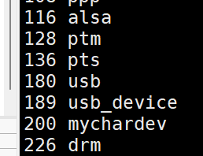
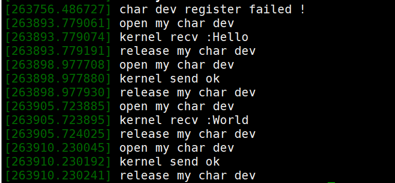

# 字符设备驱动编程入门

本文主要从三个方面讲解:

1. 字符设备驱动程序背后的概念
2. 可以在字符设备上执行的各种操作
3. 处理等待队列

## 概览

Linux将驱动分为三大类：字符设备驱动、块设备驱动以及网络设备驱动，字符类驱动是按字节流进行读写操作的，例如I2C，GPIO等驱动。

在UNIX 中(Linux继承于Unix)，用户通过特殊的设备文件来访问硬件设备。这些文件被分组到/dev目录中，系统调用open、read、write、close、lseek、mmap等被操作系统重定向到与物理设备关联的设备驱动程序。设备驱动程序是与硬件设备交互的内核组件（通常是模块）。

这里说明一点，DPDK中用到的UIO其实就是字符设备驱动的一种。

一般每个字符设备或者块设备都会在/dev目录下对应一个设备文件。Linux用户层程序通过设备文件来使用驱动程序操作字符设备或块设备。

注:网络驱动，尤其是DPDK网络驱动会在/dev/uioX(X为0,1,2....)中对应设备文件。

## 字符驱动编程步骤概览

简单描述linux下应用程序如何调用驱动程序：

1. 应用程序中调用`open()`,`close()`,`read()`,`write()`等API函数。
2. API函数会调用Linux提供的对应库函数。
3. 通过系统调用进入内核。
4. 最终调动驱动程序来控制硬件设备。

Linux字符设备驱动，主要关注以下函数及结构体实现：
1. `module_init()`，模块加载函数；
2. `module_exit()`，模块卸载函数；
3. `file_operations`结构体：
4. 结构体之下的各类操作函数实现，`open()`,`read()`,`write()`,`ioctl()`,`release()`等.
5. 字符设备号的申请；

具体细节来讲分为三大模块,对应上面提到的驱动中的3，4，5的实现:

**1. 驱动初始化**

- 分配cdev
  - 静态分配
  - 动态分配
- 初始化cdev -- `cdev_init()`
- 注册cdev -- `cdev_add()`
- 硬件初始化

**2. 实现设备操作**

这里核心是结构体`struct file_operations`。

```c
struct file_operations {
	struct module *owner;
	loff_t (*llseek) (struct file *, loff_t, int);
	ssize_t (*read) (struct file *, char __user *, size_t, loff_t *);
	ssize_t (*write) (struct file *, const char __user *, size_t, loff_t *);
	ssize_t (*read_iter) (struct kiocb *, struct iov_iter *);
	ssize_t (*write_iter) (struct kiocb *, struct iov_iter *);
	int (*iterate) (struct file *, struct dir_context *);
	unsigned int (*poll) (struct file *, struct poll_table_struct *);
	long (*unlocked_ioctl) (struct file *, unsigned int, unsigned long);
	long (*compat_ioctl) (struct file *, unsigned int, unsigned long);
	int (*mmap) (struct file *, struct vm_area_struct *);
	int (*open) (struct inode *, struct file *);
	int (*flush) (struct file *, fl_owner_t id);
	int (*release) (struct inode *, struct file *);
    // 省略
};
```

内核模块编程中非常多的类似的操作，声明一个结构体，该结构体是内核声明的内部为函数指针。实现对应函数赋值到该结构体的函数指针变量上即完成了对应功能。

- `open()`
- `read()`，read函数的实现往往会用到一个内核提供的函数`copy_to_user`作用是向用户空间拷贝数据。
- `write()`，与之相对的write函数也往往会用到内核提供的函数`copy_from_user`作用是从用户空间拷贝数据。注意和read的差别，一个是把字符传递给用户空间，write是从用户空间获取数据。
- `lseek()`
- `close()`

一般来说至少得实现上述五个函数，分别对应操作为打开，读取，写入，获取文件偏移，关闭。

重中之重为读取，写入和获取文件偏移。分别对应的操作是查，增，改(改是通过文件偏移+写入实现的)。

**3. 实现驱动注销相关操作**

- `cdev_del`
- `unregister_chrdev_region`


## 字符驱动所使用到的API

cdev相关API

```c
// 动态申请(构造)cdev内存(设备对象)
struct cdev * cdev_alloc(void);
// 初始化cdev的成员,并建立cdev和file_operations之间的联系
void cdev_init(struct cdev *cdev, struct file_operations *fops);
// 注册cdev设备对象
int cdev_add(struct cdev *dev, dev_t num, unsigned int count);
// 将cdev对象从系统中移除(注销)
void cdev_del(struct cdev *dev);
// 释放cdev内存
void cdev_put (struct cdev *p);
```

设备号获取相关宏

```c
// 从设备号中提取主设备号
#define MAJOR(dev)	((unsigned int) ((dev) >> MINORBITS))
// 从设备号中提取次设备号
#define MINOR(dev)	((unsigned int) ((dev) & MINORMASK))
// 将主,次设备号拼凑为设备号
#define MKDEV(ma,mi)	(((ma) << MINORBITS) | (mi))
```

申请，释放设备号相关API

```c
// 静态申请设备号
int register_chrdev_region (dev_t from, unsigned count, const char *name);
// 动态申请设备号
int alloc_chrdev_region (dev_t *dev, unsigned baseminor, unsigned count, const char *name);
// 释放设备号
void unregister_chrdev_region (dev_t from, unsigned count);
```

## 驱动层实际代码

直接看代码吧，字符设备的逻辑很简单的。其具体实现参考注册的`file_operations`即可。

了解了这里就可以看DPDK驱动的驱动了。

```c
#include <linux/types.h>
#include <linux/kernel.h>
#include <linux/delay.h>
#include <linux/ide.h>
#include <linux/init.h>
#include <linux/module.h>

#define CHAR_MAJOR 200 //主设备号
#define CHAR_NAME "mychardev" //设备名称

static char readbuf[100];
static char writebuf[100];

//打开设备
static int chrdev_open(struct inode *inode, struct file *filp)
{
  printk(KERN_EMERG"open my char dev");
  return 0;
}


//用户空间从设备读取数据
static ssize_t chrdev_read(struct file *filp, char __user *buf,
                      size_t cnt, loff_t *offt)
{
  int ret;

  ret = copy_to_user(buf, readbuf, cnt); //向用户空间拷贝数据
  if(ret == 0) {
    printk(KERN_EMERG"kernel send ok");
  }
  else {
    printk(KERN_EMERG"kernel send err");
  }
  return;
}
//用户空间向设备写数据
static ssize_t chrdev_write(struct file *filp,
                      const char __user *buf, size_t cnt, loff_t *offt)
{
  int ret;
  ret = copy_from_user(writebuf, buf, cnt);//从用户空间拷贝数据
  if(ret == 0) {
    memcpy(readbuf, writebuf, sizeof(readbuf));
    printk(KERN_EMERG"kernel recv :%s" ,writebuf);
  }
  else {
    printk(KERN_EMERG"kernel recv err");
  }
  return 0;
}
//设备释放
static int chrdev_release(struct inode *inode, struct file *filp)
{
  printk(KERN_EMERG"release my char dev");
  return 0;
}

//相关操作函数结构体填充
static struct file_operations chrdev_fops = {
  .owner = THIS_MODULE,
  .open = chrdev_open,
  .read = chrdev_read,
  .write = chrdev_write,
  .release = chrdev_release,
};

static int __init chrdev_init(void)
{
  int ret;
  memcpy(readbuf,”hello i am dev date”,sizeof(“hello i am dev dat”));

  ret = register_chrdev(CHAR_MAJOR,CHAR_NAME,&chrdev_fops); //注册字符设备
  if(ret == 0) {
    printk(KERN_EMERG"char dev register failed ！\r\n");
    return 0;
  }

  printk(KERN_EMERG"char dev register success ！\r\n");
}

static void __exit chrdev_exit(void)
{
  unregister_chrdev(CHAR_MAJOR,CHAR_NAME); //注销字符设备
  printk(KERN_EMERG"chr dev exit");
}

//指定设备驱动入口和出口函数
module_init(chrdev_init);
module_exit(chrdev_exit);

MODULE_LICENSE("GPL");
MODULE_AUTHOR("helintong");
```

核心是

```c
//相关操作函数结构体填充
static struct file_operations chrdev_fops = {
  .owner = THIS_MODULE,
  .open = chrdev_open,
  .read = chrdev_read,
  .write = chrdev_write,
  .release = chrdev_release,
};
```

注:上述实现仅最简单的实现，缺少多线程等支持。

DPDK的网卡驱动注册probe的代码如下:

```c
static struct rte_pci_driver rte_ixgbe_pmd = {
	.id_table = pci_id_ixgbe_map,
	.drv_flags = RTE_PCI_DRV_NEED_MAPPING | RTE_PCI_DRV_INTR_LSC,
	.probe = eth_ixgbe_pci_probe,
	.remove = eth_ixgbe_pci_remove,
};
```

和字符驱动十分类似，硬件的软驱动基本都是这样实现的。

## 应用层代码

直接看代码吧，应用层代码就是调用linux提供的系统api来读写设备。

```c
#include <stdio.h>
#include <unistd.h>
#include <sys/types.h>
#include <sys/stat.h>
#include <fcntl.h>
#include <stdlib.h>
#include <string.h>

static char usrdata[] = {"usr data!"};

int main(int argc, char *argv[])
{
  int fd, retvalue;
  char *filename;
  char readbuf[100], writebuf[100];

  if(argc != 4) {
    printf("Error Usage!\r\n");
    return -1;
  }

  filename = argv[1];
  /* 打开驱动文件 */

  fd = open(filename, O_RDWR);

  if(fd < 0) {
    printf("Can't open file %s\r\n", filename);
    return -1;
  }

  if(atoi(argv[2]) == 1) { /* 从驱动文件读取数据 */
    retvalue = read(fd, readbuf, 50);
    if(retvalue < 0) {
      printf("read file %s failed!\r\n", filename);
    }
    else {
      printf("read data:%s\r\n",readbuf);
    }
  }

  if(atoi(argv[2]) == 2) {
    /* 向设备驱动写数据 */
    memcpy(writebuf, argv[3], sizeof(argv[3]));
    retvalue = write(fd, writebuf, sizeof(argv[3]));

    if(retvalue < 0) {
      printf("write file %s failed!\r\n", filename);
    }
  }
  /* 关闭设备 */
  retvalue = close(fd);

  if(retvalue < 0) {
    printf("Can't close file %s\r\n", filename);
    return -1;
  }

  return 0;
}
```

## 编译

驱动的编译文件如下:

```Makefile
#Makefile文件注意：假如前面的.c文件起名为first.c，那么这里的Makefile文件中的.o文
#件就要起名为first.o    只有root用户才能加载和卸载模块
obj-m:=mychar_dev.o                          #产生mychar_dev模块的目标文件
#目标文件  文件  要与模块名字相同
CURRENT_PATH:=$(shell pwd)             #模块所在的当前路径
LINUX_KERNEL:=$(shell uname -r)        #linux内核代码的当前版本
LINUX_KERNEL_PATH:=/usr/src/linux-headers-$(LINUX_KERNEL)

all:
	make -C $(LINUX_KERNEL_PATH) M=$(CURRENT_PATH) modules    #编译模块
#[Tab]              内核的路径       当前目录编译完放哪  表明编译的是内核模块

clean:
	make -C $(LINUX_KERNEL_PATH) M=$(CURRENT_PATH) clean      #清理模块
```

应用程序的编译:

```shell
gcc -o usermode write_read_usermode.c
```

## 加载与使用


1. 加载字符设备驱动

```shell
# 加载字符设备驱动
insmod mychar_dev.ko
```

2. 查看驱动列表是否加载成功

```shell
cat /proc/devices
```



结果如上图可以看到设备号为200的已经完成注册了。

3. 创建节点

```shell
# mknod [OPTION] NAME TYPE [MAJOR MINOR]
# 该命令核心参数是type和最后两个数字，
# type存在c表示字符，b表示块，p表示管道
# MAJOR和MINOR代表主设备号和次设备号
mknod /dev/mychar c 200 0
```

mknod 对于创建与硬件或虚拟设备交互的设备文件至关重要。如果没有这些文件，应用程序和系统实现将无法与硬件进行通信。

4. 应用程序使用

```shell
# 写入Hello
./usermode /dev/mychar 2 Hello
# 输出现在存入字符驱动的字符
./usermode /dev/mychar 1 1
# 写入World
./usermode /dev/mychar 2 World
# 输出现在存入字符驱动的字符
./usermode /dev/mychar 1 1
```

4. 查看内核输出



# 总结

实现一个最简单的字符驱动设备的关键在于实现`file_operations`中的各种函数。

注:上述没办法作为真正的字符驱动，因为根本没计算文件偏移，也没有做可读或不可读等判断也没有加锁(等待队列)等机制。